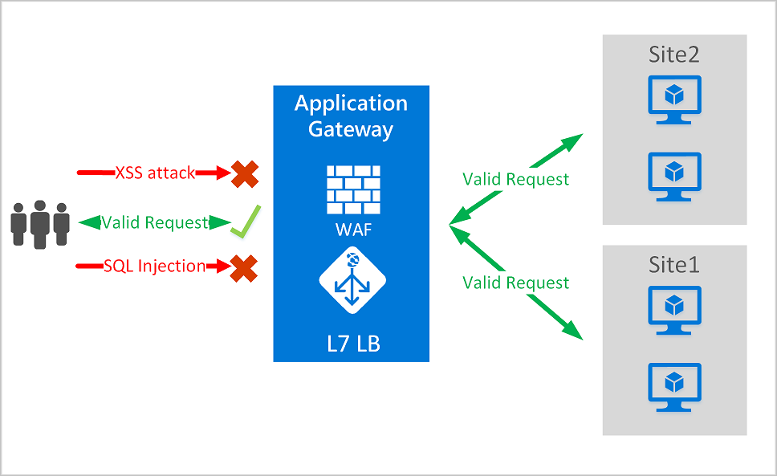
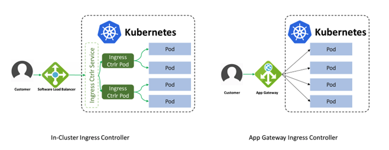

# Azure WAF And Front Door On an Existing AKS

## Goal

Evaluate the best solution to protect a web application that runs in AKS cluster from common exploits and vulnerabilities.

## Objectives

1. Set a scenario where there is an existing web app with an AKS and an NGINX ingress controller

2. What would it take to add Azure Web Application Firewall (WAF) on Azure Application Gateway

3. Evaluate Azure Front Door and its benefit

### Web Application Firewall (WAF)

Protection:
- Protect your web applications from web vulnerabilities and attacks without modification to back-end code.

- Protect multiple web applications at the same time. An instance of Application Gateway can host up to 40 websites that are protected by a web application firewall.

- Create custom WAF policies for different sites behind the same WAF

- Protect your web applications from malicious bots with the IP Reputation ruleset

The features of Azure WAF are pretty compelling:

- SQL-injection protection.
- Cross-site scripting protection.
- Protection against other common web attacks, such as command injection, HTTP request smuggling, HTTP response splitting, and remote file inclusion.
- Protection against HTTP protocol violations.
- Protection against HTTP protocol anomalies, such as missing host user-agent and accept headers.
- Protection against crawlers and scanners.
- Detection of common application misconfigurations (for example, Apache and IIS).
- Configurable request size limits with lower and upper bounds.
- Exclusion lists let you omit certain request attributes from a WAF evaluation. A common example is Active Directory-inserted tokens that are used for authentication or password fields.
- Create custom rules to suit the specific needs of your applications.
- Geo-filter traffic to allow or block certain countries/regions from gaining access to your applications.
- Protect your applications from bots with the bot mitigation ruleset.
- Inspect JSON and XML in the request body

### Implementing the Application Gateway to an existing AKS

The Application Gateway Ingress Controller allows Azure Application Gateway to be used as the ingress for an Azure Kubernetes Service aka AKS cluster.

As shown in the figure below, the ingress controller runs as a pod within the AKS cluster. It consumes Kubernetes Ingress Resources and converts them to an Azure Application Gateway configuration which allows the gateway to load-balance traffic to Kubernetes pods.

Much like the most popular Kubernetes Ingress Controllers, the Application Gateway Ingress Controller provides several features, leveraging Azure’s native Application Gateway L7 load balancer. To name a few:

1. URL routing
2. Cookie based affinity
3. SSL termination
4. End-to-End SSL
5. Support for public, private and hybrid websites
6. Integrated WAF

The architecture of the Application Gateway Ingress Controller differs from that of a traditional in-cluster L7 load balancer. The architectural differences are shown in this diagram:

- An in-cluster load balancer performs all data path operations leveraging the Kubernetes cluster’s compute resources. It competes for resources with the business apps it is fronting. In-cluster ingress controllers create Kubernetes Service Resources and leverage kubenet for network traffic. In comparison to Ingress Controller, traffic flows through an extra hop.

- Application Gateway Ingress Controller leverages the AKS' advanced networking, which allocates an IP address for each pod from the subnet shared with Application Gateway. Application Gateway Ingress Controller has direct access to all Kubernetes pods. This eliminates the need for data to pass through kubenet.

References:

https://docs.microsoft.com/en-us/azure/aks/
ingress-internal-ip#create-an-ingress-controller
https://docs.microsoft.com/en-us/azure/web-application-firewall/ag/ag-overview
https://docs.microsoft.com/en-us/azure/aks/kubernetes-helm
https://docs.microsoft.com/en-us/azure/container-registry/container-registry-helm-repos
https://docs.microsoft.com/en-us/azure/aks/ingress-internal-ip
https://docs.microsoft.com/en-us/azure/container-registry/container-registry-get-started-azure-cli
https://stacksimplify.com/azure-aks/azure-kubernetes-service-ingress-basics/
https://docs.microsoft.com/en-us/azure/aks/ingress-basic
https://kubernetes.io/docs/concepts/services-networking/ingress/
https://docs.microsoft.com/en-us/azure/architecture/example-scenario/aks-agic/aks-agic
https://github.com/MicrosoftDocs/azure-docs/blob/master/articles/web-application-firewall/afds/waf-front-door-configure-ip-restriction.md